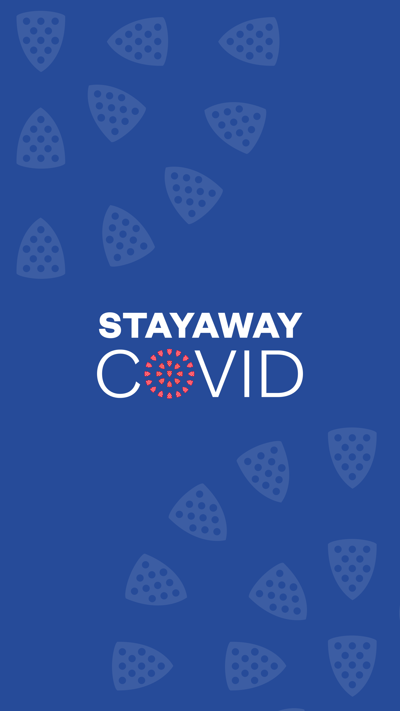
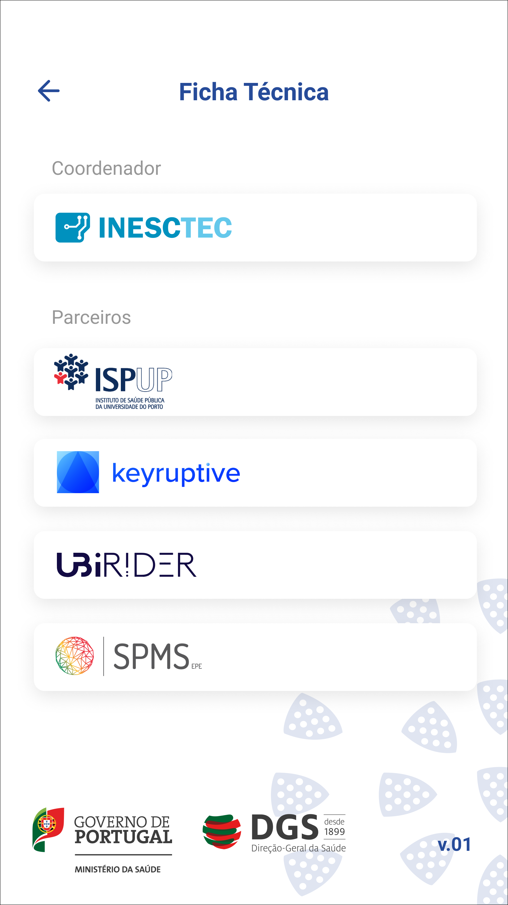

<h1 align="center">STAYAWAY COVID</h1>
<h4 align="center">Covid-19 Exposure Notification App for Portugal 🇵🇹</h4>

<br />

<div align="center">
  
</div>

<div align="center">
    <!-- Version -->
    <a href="https://github.com/stayawayinesctec/stayaway-app">
      
    </a>
    <!-- Build -->
    <a href="https://github.com/stayawayinesctec/stayaway-app/actions?query=workflow%3A%22Android+Production+Build%22">
      
    </a>
    <!-- License -->
    <a href="https://github.com/stayawayinesctec/stayaway-app/blob/master/LICENSE">
      
    </a>
</div>

# Introduction
[STAYAWAY COVID](https://stayaway.inesctec.pt/en/) is a voluntary system aiming at supporting Portuguese Health Authorities in the screening of COVID-19. This repository contains the STAYAWAY COVID source code for both Android and iOS. Before anyone can run the app, a Pilot was launched in order to improve the detection and correction of any issues. The Pilot phase is restricted to a defined number of invited users, though we provide an UI only mode as detailed in the building section. So, if not everyone can run it, why are we open-sourcing the code? It's pretty simple actually, for a reason of transparency, public scrutiny and security. We believe that such an important application should be available to the community. We welcome any bug reports, security or privacy concerns that you might have with the app and will do our best to address them.

STAYAWAY COVID is a [React Native](https://reactnative.dev) project built on top of the Decentralised Privacy-Preserving Proximity Tracing (DP^3T) project. DP^3T is an open protocol for COVID-19 proximity tracing using Bluetooth Low Energy functionality on mobile devices that ensures personal data and computation stays entirely on an individual's phone. STAYAWAY COVID relies on the open source DP^3T SDKs, which are the implementation of the DP^3T protocol using the [Exposure Notification Framework](https://developer.apple.com/documentation/exposurenotification) of Google and Apple. DP^3T is a completely separate project, for any issues, concerns or checking the source code, please visit the [official repository](https://github.com/DP-3T).

In the course of a pandemic, timely diagnosis of the population and informed reporting are crucial to break and control the chains of transmission. In the case of COVID-19, this does not come easy given the extended incubation period of the disease and the fact that, in many cases, infected patients are asymptomatic.

Thanks to STAYAWAY COVID, we are able to find out if we are at risk of being infected, based on the contacts we have been close to in the previous couple of weeks. A community-wide uptake of this app will turn it into a valuable and decisive ally in the fight against COVID-19.

The project was led by [INESC TEC](https://www.inesctec.pt) with the collaboration of [Keyruptive](https://www.keyruptive.com) and [Ubirider](https://www.ubirider.com).

<p align="center">




</p>

# Installation and Building
## Requirements

To build the project you'll need to setup your React Native development environment, which can achieved by following the steps at [https://reactnative.dev/docs/environment-setup](https://reactnative.dev/docs/environment-setup). The requirements will depend on your development platform.

### Android

Only approved government public health authorities can access the Exposure Notification APIs. STAYAWAY COVID for Android will not work properly unless either your account is whitelisted as test account or your app is approved by Google and signed with the production certificate.

Required tools for building:
- Watchman
- Node 8.3
- Yarn
- Java SE Development Kit 8
- Android Studio
- Android SDK

### iOS

Only approved government public health authorities can access the Exposure Notification APIs. STAYAWAY COVID for iOS will only work correctly if you were granted the `com.apple.developer.exposure-notification` entitlement by [Apple](https://developer.apple.com/contact/request/exposure-notification-entitlement). The `ExposureNotification.framework` is available starting with iOS 13.5.

Required tools for building:
- Watchman
- Node 8.3
- Yarn
- CocoaPods
- XCode

## Installation
- Clone or download this repository.
```sh
git clone https://github.com/stayawayinesctec/stayaway-app.git
```

- Copy .env.example to .env.{production,ui}.debug and fill in the variables with your own information, eg:
```sh
cp .env.example .env.production.debug
```

- Install dependencies by running:
```sh
yarn
```

- If you're using **android**, you'll also need to manually download the binary distribution of [`play-services-nearby`](https://github.com/google/exposure-notifications-android/blob/master/app/libs/play-services-nearby-18.0.3-eap.aar) and attach it to your project on `android/app/libs`. You can do so by running on your project root:

```sh
wget https://github.com/google/exposure-notifications-android/blob/master/app/libs/play-services-nearby-18.0.3-eap.aar -P android/app/libs
```

## Building
- And finally, build the project:
```sh
yarn android # or yarn android-ui
yarn ios # or yarn ios-ui
```

NOTE: Running `android-ui` or `ios-ui` will allow you to run and test the applications' user interface without requiring to activate the Exposure Notification API.

# Copyright and license

Copyright (c) 2020 INESC TEC. Developed with [Keyruptive](https://keyruptive.com). This project is licensed under the terms of the EUPL-1.2 license. Please see the [LICENSE](LICENSE) file for full reference.

Some files contain code from the [DP3T applications](https://github.com/DP-3T), Copyright (c) 2020 [Ubique Innovation AG](https://www.ubique.ch). These files are  are marked as such and licensed also under MPL-2.0.

## Third-party components licenses
### Tools
| Name                                  | License      |
|---------------------------------------|--------------|
| [Gradle](https://gradle.org/)         | Apache 2.0   |
| [Cocoapods](https://cocoapods.org/)   | MIT          |

### Libraries
| Name                                                            | License      |
|-----------------------------------------------------------------|--------------|
| [DP3T-SDK-Android](https://github.com/DP-3T/dp3t-sdk-android)   | MPL 2.0      |
| [DP3T-SDK-iOS](https://github.com/DP-3T/dp3t-sdk-ios)           | MPL 2.0      |
| [OkHttp](https://github.com/square/okhttp/)                     | Apache 2.0   |
| [Retrofit](https://github.com/square/retrofit)                  | Apache 2.0   |
| [TrustKit](https://github.com/datatheorem/TrustKit)             | MIT          |

### Fonts
| Name                                                 | License      |
|------------------------------------------------------|--------------|
| [Roboto](https://fonts.google.com/specimen/Roboto)   | Apache 2.0   |

### React Native Packages
| Name                                                                                                              | License      |
|-------------------------------------------------------------------------------------------------------------------|--------------|
| [@react-native-community/async-storage](https://www.npmjs.com/package/@react-native-community/async-storage)      | MIT          |
| [@react-native-community/checkbox](https://www.npmjs.com/package/@react-native-community/checkbox)                | MIT          |
| [@react-native-community/masked-view](https://www.npmjs.com/package/@react-native-community/masked-view)          | MIT          |
| [@react-native-community/netinfo](https://www.npmjs.com/package/@react-native-community/netinfo)                  | MIT          |
| [@react-navigation/bottom-tabs](https://www.npmjs.com/package/@react-navigation/bottom-tabs)                      | MIT          |
| [@react-navigation/native](https://www.npmjs.com/package/@react-navigation/native)                                | MIT          |
| [@react-navigation/stack](https://www.npmjs.com/package/@react-navigation/stack)                                  | MIT          |
| [i18n-js](https://www.npmjs.com/package/i18n-js)                                                                  | MIT          |
| [lodash.pickby](https://www.npmjs.com/package/lodash.pickby)                                                      | MIT          |
| [lodash.memoize](https://www.npmjs.com/package/lodash.memoize)                                                    | MIT          |
| [mirror-creator](https://www.npmjs.com/package/mirror-creator)                                                    | MIT          |
| [moment](https://www.npmjs.com/package/moment)                                                                    | MIT          |
| [react](https://www.npmjs.com/package/react)                                                                      | MIT          |
| [react-native](https://www.npmjs.com/package/react-native)                                                        | MIT          |
| [react-native-android-location-enabler](https://www.npmjs.com/package/react-native-android-location-enabler)      | MIT          |
| [react-native-config](https://www.npmjs.com/package/react-native-config)                                          | MIT          |
| [react-native-elements](https://www.npmjs.com/package/react-native-elements)                                      | MIT          |
| [react-native-gesture-handler](https://www.npmjs.com/package/react-native-gesture-handler)                        | MIT          |
| [react-native-indicators](https://www.npmjs.com/package/react-native-indicators)                                  | BSD-3-Clause |
| [react-native-keyboard-aware-scroll-view](https://www.npmjs.com/package/react-native-keyboard-aware-scroll-view)  | MIT          |
| [react-native-localize](https://www.npmjs.com/package/react-native-localize)                                      | MIT          |
| [react-native-modal](https://www.npmjs.com/package/react-native-modal)                                            | MIT          |
| [react-native-permissions](https://www.npmjs.com/package/react-native-permissions)                                | MIT          |
| [react-native-reanimated](https://www.npmjs.com/package/react-native-reanimated)                                  | MIT          |
| [react-native-safe-area-context](https://www.npmjs.com/package/react-native-safe-area-context)                    | MIT          |
| [react-native-screens](https://www.npmjs.com/package/react-native-screens)                                        | MIT          |
| [react-native-splash-screen](https://www.npmjs.com/package/react-native-splash-screen)                            | MIT          |
| [react-native-svg](https://www.npmjs.com/package/react-native-svg)                                                | MIT          |
| [react-native-svg-icon](https://www.npmjs.com/package/react-native-svg-icon)                                      | MIT          |
| [react-native-swiper](https://www.npmjs.com/package/react-native-swiper)                                          | MIT          |
| [react-native-vector-icons](https://www.npmjs.com/package/react-native-vector-icons)                              | MIT          |
| [react-native-version-number](https://www.npmjs.com/package/react-native-version-number)                          | MIT          |
| [react-navigation-redux-debouncer](https://www.npmjs.com/package/react-navigation-redux-debouncer)                | MIT          |
| [react-redux](https://www.npmjs.com/package/react-redux)                                                          | MIT          |
| [redux-actions](https://www.npmjs.com/package/redux-actions)                                                      | MIT          |
| [redux-saga](https://www.npmjs.com/package/redux-saga)                                                            | MIT          |
| [reselect](https://www.npmjs.com/package/reselect)                                                                | MIT          |
